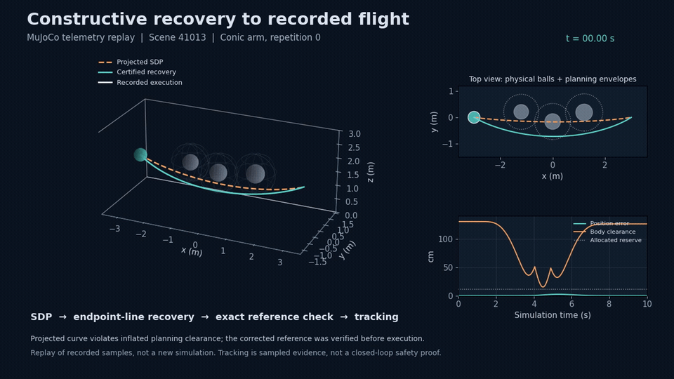
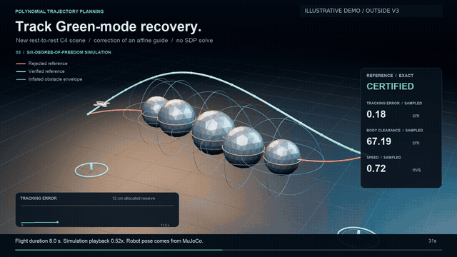

# Certified Polynomial Trajectory Planning

**From semidefinite relaxations to verified polynomial trajectories.**

A research artifact for inspecting trajectory recovery, checking continuous-time
reference constraints, and replaying recorded quadrotor flights.

✅ 80 exact root-SDP objective certificates across 20 scene IDs<br>
✅ Exact rational checks of stored polynomial trajectories<br>
✅ Recorded tracking telemetry and independent replay<br>
✅ Preserved V3 results, including unsuccessful planning attempts

The new **`objective_repair_20260909`** campaign records **80/80 physical,
tracking, and exact root-SDP objective successes**. It documents post-hoc
debugging on the original V3 population, not a fresh confirmatory experiment.

**Video scope: the media below shows historical V3 and a separate earlier
illustration. It does not show the new objective-repair campaign.**

[](assets/v3-replay.mp4)

**[Watch the historical V3 replay · 15 s](assets/v3-replay.mp4)** ·
**[Watch the full demo · 82 s](video/v3_execution.mp4)** ·
[Quick start](#quick-start) · [New campaign](#objective-repair-campaign) ·
[Reproduction guide](docs/REPRODUCIBILITY.md)

*Scene 41013, conic arm, repetition 0. The moving sphere represents the recorded
0.23 m robot body envelope. This is a replay of a MuJoCo run.*

## Why certified polynomial planning?

A trajectory projected from an SDP relaxation can still intersect an obstacle.
The research pipeline recovers a physical polynomial curve, checks its reference
constraints, and then evaluates how a simulated robot tracks it:

**SDP relaxation → trajectory recovery → exact reference verification → tracking**

The reference checks use rational Bernstein coefficients to verify endpoint and
continuity constraints, strict obstacle clearance, workspace bounds, and
time-scaled speed, acceleration, and jerk limits. Tracking errors and body
clearances are measured separately from simulation telemetry.

The objective checker separately verifies a rational interval enclosing the
**root SDP relaxation optimum**. Its witness may differ from the candidate used
to recover the physical reference. This does not establish global optimality of
the recovered trajectory or continuous-time closed-loop safety.

This repository contains **verification and replay code with recorded data**.
Optimization runners and the MuJoCo controller/simulation runner are not included
in this public export. The commands below check the stored experiment and rebuild
its visualization.

## Quick start

Use **Python 3.12 or newer**. Run these commands from a terminal:

```sh
git clone https://github.com/NamDinhRobotics/certified-polynomial-planning.git
cd certified-polynomial-planning

python -m venv .venv
. .venv/bin/activate
python -m pip install numpy sympy

# Replay the new campaign's objective, physical, and tracking checks.
python code/verify_campaign.py --campaign objective_repair_20260909 --mutations

# Check the preserved historical V3 population and rejection controls.
python code/verify.py --mutations

# Also replay historical V3 physical-reference checks and tracking measurements.
python code/verify.py --physical --mutations
```

On Windows, activate the environment with `.venv\Scripts\Activate.ps1` in
PowerShell. Use `python`, without `-O`, for the exact checks.
Install Matplotlib and FFmpeg only to rebuild video or README media; MuJoCo is
not needed to inspect the recorded results.

## Objective-repair campaign

Campaign **`objective_repair_20260909`** contains the same 20 scene IDs ×
2 repetitions × 2 arms = **80 attempts**. The stages must be kept distinct:

| Stage | Physical references | Tracking passes | Root-SDP objective certificates |
| --- | ---: | ---: | ---: |
| Historical V3 (`v3_20260909`) | 40 / 80 | 40 / 80 | 32 / 80 |
| Intermediate candidate-recovery debugging | 80 / 80 | 80 / 80 | 32 / 80 |
| Objective repair (`objective_repair_20260909`) | **80 / 80** | **80 / 80** | **80 / 80** |

Historical V3 objective counts are archived acceptance outcomes; its existing
checker does not replay dual certificates. The new campaign supplies exact
objective witnesses and a dedicated verifier. Its rational reference
coefficients and tracking metrics are unchanged **relative to the intermediate
candidate-recovery stage**, not relative to original V3.

| Certificate path | Attempts |
| --- | ---: |
| Retained original valid certificate | 32 |
| Repaired dual witness in normalized units | 20 |
| Independent objective witness from the same SDP, using `energy_unit / 4` | 28 |
| **Total** | **80** |

All exact relative interval gaps are at most **8.027405685153957 × 10⁻⁶**
(an outward-rounded bound), below the unchanged **10⁻⁵** acceptance threshold.
Witness retries use a separate
context and do not replace the recovered reference. The original numerical
root gate still rejects **40 attempts**; those labels remain preserved even
where a subsequent exact witness passes.

The witness fallback adds **56 conic solver calls**, for **206 conic calls**
across the campaign. Historical V3 latency measurements and speed comparisons
do not measure this repaired pipeline. This is post-hoc validation on a reused
population; scene IDs do not imply independent geometry, and the result does
not establish performance on unseen scenes.

Verified replay totals for the quick-start command are **80 objective
certificates, 80 physical curves, 1,200 clearance polynomials, 1,800 recovery
cells, 824,080 tracking samples, and 13 rejected mutations**. See the
[reproduction guide](docs/REPRODUCIBILITY.md) for scope and data provenance.
The sample total counts all 80 referenced runs; identical telemetry is stored
once, giving **25 unique logs with 256,025 samples**.

## Historical V3 results

The following values describe **the preserved V3 data**, identified as
`v3_20260909` in the campaign index. They are finite recorded results and are
separate from the objective-repair campaign.

### Matched conic–factor comparison

The solver dataset contains 20 seeds × 8 steps × 2 repetitions: **320 pairs,
640 solver calls**. Both arms returned physically accepted trajectories on all
320 paired inputs.

| Quantity | Recorded result |
| --- | ---: |
| Median recovered-energy ratio, factor / conic | 1.000 |
| Recovered-energy ratio, minimum–maximum | 0.901–1.215 |
| Pairs where factor energy is more than 1% higher | 56 / 320 |
| Pairs where conic energy is more than 1% higher | 14 / 320 |
| Median paired physical-return latency difference, factor − conic | +2.824 ms |
| Median paired complete-return latency difference, factor − conic | +3.777 ms |
| Factor-arm calls using conic fallback | 124 / 320 |

Positive paired latency differences mean the factor arm took longer. These data
do not establish an end-to-end speedup. Physical return and complete return are
distinct recorded endpoints; see the [definitions and verification scope](docs/REPRODUCIBILITY.md#what-the-checker-verifies).

### Quadrotor campaign

The robot dataset contains **20 scenes × 2 repetitions × 2 arms = 80 planning
attempts**. Counts below combine both arms and repetitions.

| Scene group | Scenes attempted | Planning attempts | Physically accepted / executed | Root failures |
| --- | ---: | ---: | ---: | ---: |
| Easy | 5 | 20 | 20 | 0 |
| Cluttered | 10 | 40 | 20 | 20 |
| On-axis recovery target | 5 | 20 | 0 | 20 |
| **Total** | **20** | **80** | **40** | **40** |

The **40 executed runs span 10 distinct scenes**; all passed the recorded
tracking acceptance rule. Across those executions, the maximum position error
was **2.47 cm** and minimum sampled body clearance was **14.71 cm**.
The remaining 40 planning attempts failed before execution.

For the specific run shown above, minimum sampled body clearance is **15.17 cm**.
Its scene-level value differs from the campaign minimum. A certified reference
and sampled tracking measurements do not constitute a continuous-time
closed-loop safety proof or a hardware flight result.

## Videos

### V3 telemetry replay

**This video remains a historical V3 replay.** The
[15-second replay](assets/v3-replay.mp4) shows the projected SDP curve,
the recovered reference, recorded positions, tracking error, and body clearance.
Rebuild it directly from the stored coefficients and telemetry:

```sh
python code/video.py --output results/v3_replay.mp4
```

### 3D flight illustration

[](video/v3_execution.mp4)

*This earlier illustration uses separate scenes and metrics outside V3.
Its tracking scene recovers an affine guide without an SDP solve.*

The [full movie](video/v3_execution.mp4) is silent and contains:

| Time | Content |
| --- | --- |
| 00:00–00:15 | V3 telemetry replay |
| 00:15–00:18 | Transition identifying the separate illustration |
| 00:18–01:22 | Earlier 3D recovery and flight illustration |

To regenerate the GIF previews and short MP4 from the existing full movie:

```sh
python code/readme_media.py
```

See the [reproduction guide](docs/REPRODUCIBILITY.md#videos-and-readme-media)
for full-movie assembly and media provenance.

## Project layout

| Path | Contents |
| --- | --- |
| [`data/campaigns/index.json`](data/campaigns/index.json) | Campaign identities; historical V3 files remain unchanged |
| [`data/campaigns/objective_repair_20260909/`](data/campaigns/objective_repair_20260909/) | New campaign metadata, compressed records, provenance, and telemetry |
| [`code/verify_campaign.py`](code/verify_campaign.py) | New campaign's exact objective, physical, tracking, and mutation checks |
| [`code/objective.py`](code/objective.py) | Rational reconstruction and verification of root-SDP objective intervals |
| [`code/verify.py`](code/verify.py) | V3 data checks, physical replay, tracking checks, and mutation controls |
| [`code/exact.py`](code/exact.py) | Rational Bernstein arithmetic and polynomial positivity checks |
| [`code/video.py`](code/video.py) | Visualization of the recorded V3 flight |
| [`code/readme_media.py`](code/readme_media.py) | GIF previews and a short MP4 extracted from the existing movie |
| [`data/`](data/) | Preserved V3 planning data, comparison CSVs, tracking logs, and separate new campaigns |
| [`video/`](video/) | Full demonstration movie |
| [`assets/`](assets/) | README media and source/clip hashes |
| [`docs/REPRODUCIBILITY.md`](docs/REPRODUCIBILITY.md) | Dataset map, checker scope, and reproduction details |

## Getting help

Open a [GitHub issue](https://github.com/NamDinhRobotics/certified-polynomial-planning/issues)
with the command, error output, Python version, and repository commit.
Maintained by [Nam Dinh](https://github.com/NamDinhRobotics).

## Referencing this artifact

Reference this repository URL together with the commit used in your experiments
(`git rev-parse HEAD`). The repository does not currently supply paper citation
metadata or a software license.
